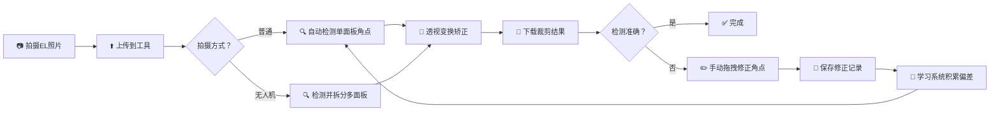
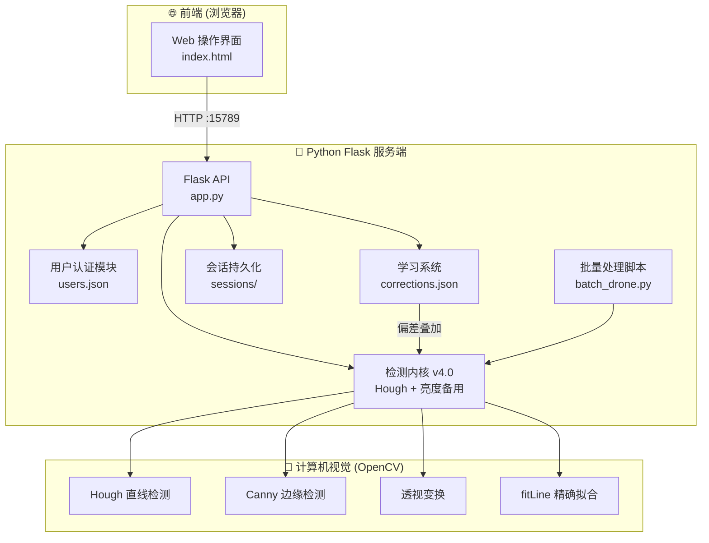
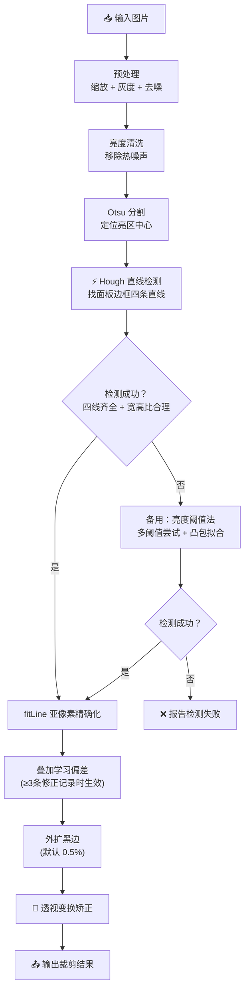
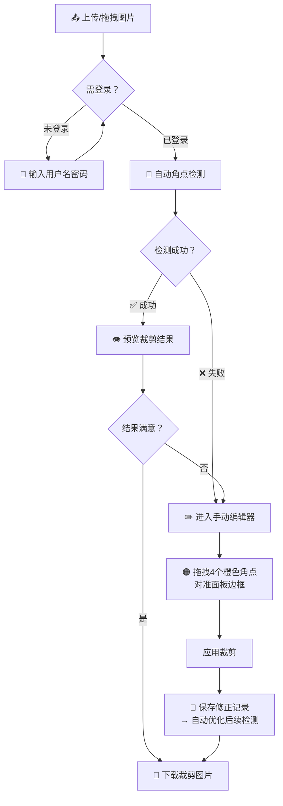
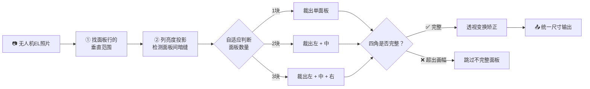

# 华矩EL裁剪工具 V1.1 — 服务端

太阳能电池板 **电致发光（EL）检测** 图像的透视裁剪工具。自动检测EL照片中电池面板的四个角点，通过透视变换矫正为规整矩形，支持普通拍摄和无人机拍摄两种模式。



## 功能特性

- **自动角点检测** — 基于 Hough 直线检测 + 亮度阈值双算法，精准定位面板边框
- **透视变换矫正** — 自动将倾斜的面板矫正为标准矩形
- **无人机模式** — 一张无人机照片自动裁出左、中、右最多3块独立面板
- **学习系统** — 记录用户手动修正，自动优化后续检测偏差（≥3条记录生效）
- **支持GPU加速** — 使用 OpenCL 自动加速图像处理
- **批量处理** — 支持多张图片同时处理（多线程）
- **用户管理** — 管理员/普通用户两级权限
- **会话持久化** — 关闭浏览器后恢复上次进度
- **Web 操作界面** — 局域网内任何设备均可访问使用

## 系统架构



```
华矩EL裁剪工具V1.1服务端/
├── 1_download_python.bat       # 步骤1：下载 Python 嵌入式环境
├── 2_install_libraries.bat     # 步骤2：安装依赖库
├── 3_start_tool.bat            # 步骤3：启动服务
├── install_libs.py             # 依赖安装脚本
├── users.json                  # 用户账号数据
├── server.log                  # 服务运行日志
├── EL组件裁剪服务端_v3.exe      # 可选独立可执行程序
├── launcher.cs                 # 启动器源码
├── runtime/                    # Python 运行时目录（自动下载）
├── app/
│   ├── app.py                  # Flask 后端主程序（检测内核 v4.0）
│   ├── index.html              # Web 前端界面
│   ├── batch_drone.py          # 无人机模式批量处理脚本
│   ├── corrections.json        # 学习样本（普通模式）
│   ├── corrections_drone.json  # 学习样本（无人机模式）
│   ├── logo.ico                # 站点图标
│   └── sessions/               # 会话持久化目录
└── .claude/                    # Claude Code 配置文件
```

## 检测内核 v4.0 说明

| 算法 | 状态 | 说明 |
|------|------|------|
| Hough 直线检测 | 主算法 | 找面板边框的四条直线，交点即为角点 |
| 亮度 Otsu 阈值 | 备用 | Hough 失败时自动降级使用 |
| fitLine 精确化 | 后处理 | 对每条边做亚像素级精确拟合 |
| 学习偏差 | 叠加 | 用户手动修正积累≥3条后自动应用 |



## 使用教程

### 环境要求

- Windows 7 / 10 / 11
- 支持 GPU 加速（NVIDIA/AMD/Intel 显卡，可选）
- 首次使用需联网下载依赖（约 90MB）

### 快速开始


#### 第一步：下载 Python

右键 **`1_download_python.bat`** → **以管理员身份运行**

自动下载 Python 3.8.10 嵌入式环境到 `runtime/` 目录（约 8MB），完成后关闭窗口。

#### 第二步：安装依赖库

右键 **`2_install_libraries.bat`** → **以管理员身份运行**

自动安装 numpy、opencv-python、flask 三个依赖库（约 80MB，耗时 3~8 分钟），完成后关闭窗口。

> **注意**：如遇下载失败，脚本会自动切换多种下载方式，请确保网络通畅。

#### 第三步：启动工具

右键 **`3_start_tool.bat`** → **以管理员身份运行**

启动后自动打开浏览器进入操作界面。服务默认运行在：

- 本机访问：http://127.0.0.1:15789
- 局域网访问：http://192.168.3.119:15789（根据实际IP变化）

**关闭启动窗口即可停止服务。**

### 登录说明

首次启动自动创建默认管理员账号：

| 用户名 | 密码 | 角色 |
|--------|------|------|
| admin | hjjc | 管理员 |

管理员可在用户管理中创建普通用户、修改密码。

### 操作流程



1. **上传图片** — 点击上传或拖拽 EL 检测照片到网页
2. **自动裁剪** — 系统自动检测面板角点并矫正
3. **手动修正**（可选）— 拖拽橙色角点调整检测位置，点击保存修正以优化后续检测
4. **下载结果** — 保存裁剪后的面板图片

### 参数说明

| 参数 | 默认值 | 说明 |
|------|--------|------|
| 水平外扩 | 0.5% | 左右方向额外保留的边框比例 |
| 垂直外扩 | 同水平 | 上下方向额外保留的边框比例（独立设置） |
| 无人机模式外扩 | 1.4% | 无人机拍摄模式默认外扩比例 |

### 无人机模式



无人机拍摄的EL照片通常包含多块并排面板：

- 自动检测面板数量（1~3块）
- 输出统一尺寸
- 自动跳过被画幅裁切的不完整面板
- 可用独立脚本 `batch_drone.py` 批量处理

### 迁移到其他电脑

复制整个文件夹（包括已下载的 `runtime/`），在新电脑只需执行步骤 3 启动即可，无需重复下载。

### 性能参考

| 模式 | 300张耗时 |
|------|-----------|
| GPU 加速 | 30~90秒 |
| CPU 模式 | 3~5分钟 |

## 开发说明

### 技术栈

- **后端**: Python 3.8 + Flask
- **计算机视觉**: OpenCV 4.x（numpy）
- **前端**: 纯 HTML / JavaScript（单页应用）
- **硬件加速**: OpenCL（可选）

### 本地开发

```bash
# 手动安装依赖
pip install numpy opencv-python flask

# 启动服务
python app/app.py
```

服务默认监听 `0.0.0.0:15789`。

## 许可证

本项目基于 **MIT 许可证** 开源。

```
MIT License

Copyright (c) 2026 华矩EL裁剪工具

Permission is hereby granted, free of charge, to any person obtaining a copy
of this software and associated documentation files (the "Software"), to deal
in the Software without restriction, including without limitation the rights
to use, copy, modify, merge, publish, distribute, sublicense, and/or sell
copies of the Software, and to permit persons to whom the Software is
furnished to do so, subject to the following conditions:

The above copyright notice and this permission notice shall be included in all
copies or substantial portions of the Software.

THE SOFTWARE IS PROVIDED "AS IS", WITHOUT WARRANTY OF ANY KIND, EXPRESS OR
IMPLIED, INCLUDING BUT NOT LIMITED TO THE WARRANTIES OF MERCHANTABILITY,
FITNESS FOR A PARTICULAR PURPOSE AND NONINFRINGEMENT. IN NO EVENT SHALL THE
AUTHORS OR COPYRIGHT HOLDERS BE LIABLE FOR ANY CLAIM, DAMAGES OR OTHER
LIABILITY, WHETHER IN AN ACTION OF CONTRACT, TORT OR OTHERWISE, ARISING FROM,
OUT OF OR IN CONNECTION WITH THE SOFTWARE OR THE USE OR OTHER DEALINGS IN THE
SOFTWARE.
```
